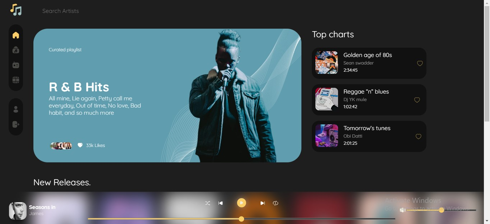
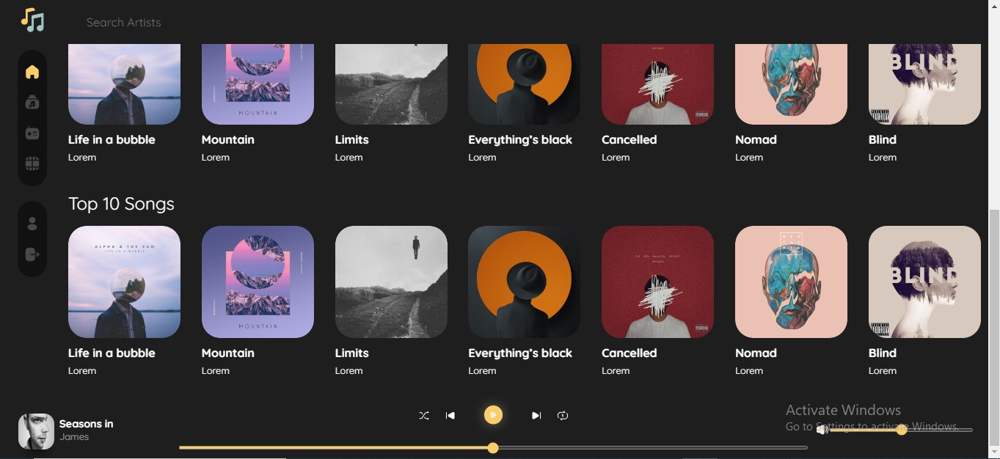

## Welcome to GitHub Pages
# Beat-Box
This is Beat-Box Landing Page
## Table of contents

- [Overview](#overview)
  - [Screenshot](#screenshot)
  - [Links](#links)
- [My process](#my-process)
  - [Built with](#built-with)

## Overview
This is Beat-Box Landing Page

### Screenshot




### Links

- Solution URL: [Add solution URL here](https://github.com/devChukz/Beat-Box)
- Live Site URL: [Add live site URL here](https://beat-box-iota.vercel.app/)

## My process
- Gathered all required resources from several stock photo sites and other music sites
- Design the layout
- Responsiveness across different screen sizes 


### Built with

- Semantic HTML5 markup
- CSS custom properties
- Vanilla JavaSript


You can use the [editor on GitHub](https://github.com/devChukz/Beat-Box/edit/main/README.md) to maintain and preview the content for your website in Markdown files.

### Markdown

Markdown is a lightweight and easy-to-use syntax for styling your writing. It includes conventions for

```markdown
Syntax highlighted code block

# Header 1
## Header 2
### Header 3

- Bulleted
- List

1. Numbered
2. List

**Bold** and _Italic_ and `Code` text

[Repository Link](https://github.com/devChukz/Beat-Box) and 
```

For more details see [Basic writing and formatting syntax](https://docs.github.com/en/github/writing-on-github/getting-started-with-writing-and-formatting-on-github/basic-writing-and-formatting-syntax).


### Support or Contact

Having trouble with Pages? Check out our [documentation](https://docs.github.com/categories/github-pages-basics/) or [contact support](https://support.github.com/contact) and we’ll help you sort it out.
